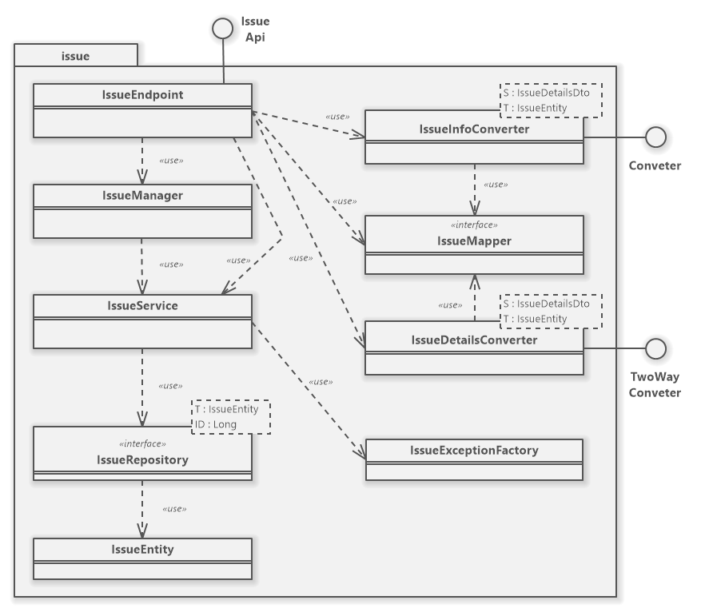
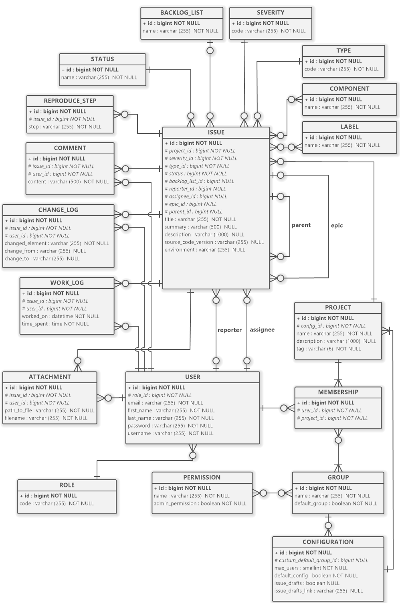

<!-- PROJECT LOGO -->
<div align="center">
<h3> BugStalker</h3>
</div>

<p>
BugStalker is a bug tracking system, that addresses the problem of ticket management in software development teams.
It is a system that supports the implementation phase of the software development life cycle by
streamlining the methods of presenting the status of issues.
BugStalker allows you to manage a large number of tickets.
The system was implemented as a web application in a client-server architecture.
</p>


BugStalker consists of three, separate projects:
* [bs-business](https://github.com/Kaliszando/bs-business) backend
* [bs-web-client](https://github.com/Kaliszando/bs-web-client) frontend
* [bs-api-specification](https://github.com/Kaliszando/bs-api-specification) API specification and generation tool


<!-- TABLE OF CONTENTS -->
<details>
  <summary>Table of Contents</summary>
  <ol>
    <li>
      <a href="#about-the-project">About The Project</a>
      <ul>
        <li><a href="#built-with">Built With</a></li>
        <li><a href="#additional-dependencies">Additional Dependencies</a></li>
        <li><a href="#technological-challenges">Technological Challenges</a></li>
        <li><a href="#uml-diagrams">UML diagrams</a></li>
      </ul>
    </li>
    <li>
      <a href="#getting-started">Getting Started</a>
      <ul>
        <li><a href="#prerequisites">Prerequisites</a></li>
        <li><a href="#installation">Installation</a></li>
      </ul>
    </li>
    <li><a href="#usage">Usage</a></li>
    <li><a href="#roadmap">Roadmap</a></li>
    <li><a href="#contact">Contact</a></li>
  </ol>
</details>


<!-- ABOUT THE PROJECT -->
## About The Project

Backend is responsible for providing main business logic and persisting data to database.
It was created using Spring Boot framework and Java 17. Backend communicates with frontend app using Rest API.
Endpoint definitions (interfaces for Spring controllers) and DTOs are generated by [bs-api-specification](https://github.com/Kaliszando/bs-api-specification) project. 


### Built With

![Java-17][Java]
![Spring][Spring]
![SpringSecurity][SpringSecurity]
![Hibernate][Hibernate]
![JWT][JWT]
![Maven][Maven]

### Additional Dependencies
* Lombok
* JUnit 5, AssertJ, Rest Assured, Mockito
* MapStruct
* Swagger
* QueryDsl

### Technological Challenges
* JWT authorization
* N+1 problem
* Optimistic locking
* AOP
* Security (password encryption, user context, endpoint authorization)
* Deployment on AWS platform
* QueryDsl + Spring Data JPA

### UML Diagrams
_UML diagrams are outdated. See corresponding domains for current state._

<details>
<summary>Issue domain</summary>

Vertical cross-section of the ```issue``` domain


</details>

<details>
<summary>Entity relationship diagram</summary>



</details>


<p align="right">(<a href="#-bugstalker">back to top</a>)</p>


<!-- GETTING STARTED -->
## Getting Started

To develop a business application, you must first [build an API project](https://github.com/Kaliszando/bs-api-specification), which serves as an essential dependency for the backend.

The API project contain models and endpoints crucial for the application. Additionally, it automatically generates code for both backend and frontend.

### Prerequisites

* Java 17+
* Maven

### Installation

1. Clone the repo
   ```sh
   git clone https://github.com/Kaliszando/bs-business.git
   ```
2. Build [API project](https://github.com/Kaliszando/bs-api-specification)
3. Build bs-business project
   ```sh
   mvn clean install
   ```
4. Run `BsBusinessApplication` with `dev-local` and `swagger` profiles or execute jar file.
   ```sh
   java -jar target/bs-business-X.X.X-SNAPSHOT.jar --spring.profiles.active=dev-local,swagger
   ```
5. Open [Swagger UI](http://localhost:8080/swagger-ui)

<p align="right">(<a href="#-bugstalker">back to top</a>)</p>


<!-- USAGE EXAMPLES -->
## Usage

[//]: # (Add video link showing basic usages)
[//]: # (//TODO)

<p align="right">(<a href="#-bugstalker">back to top</a>)</p>


<!-- ROADMAP -->
## Roadmap
See the [open issues](https://github.com/users/Kaliszando/projects/8/views/1) for a full list of proposed features and known issues.

- [x] Multiple projects context
- [x] Backlog view
- [x] Kanban board
- [x] List view (paging, query, filtering by fields)
- [x] Summary screen (charts)
- [ ] Permissions
- [ ] Admin view
- [ ] Community issues

<p align="right">(<a href="#-bugstalker">back to top</a>)</p>

<!-- CONTACT -->
## Contact

Adam Kalisz kaliszadam99+dev@gmail.com

LinkedIn [@adam-kalisz](https://www.linkedin.com/in/adam-kalisz/)

Other links [linktr.ee/kaliszando](https://linktr.ee/kaliszando)

<p align="right">(<a href="#-bugstalker">back to top</a>)</p>


<!-- MARKDOWN LINKS & IMAGES -->
[Angular.io]: https://img.shields.io/badge/Angular-DD0031?style=for-the-badge&logo=angular&logoColor=white
[Angular-url]: https://angular.io/
[Bootstrap.com]: https://img.shields.io/badge/Bootstrap-563D7C?style=for-the-badge&logo=bootstrap&logoColor=white
[Bootstrap-url]: https://getbootstrap.com
[Java]: https://res.cloudinary.com/practicaldev/image/fetch/s--KR6jSVNe--/c_limit%2Cf_auto%2Cfl_progressive%2Cq_auto%2Cw_880/https://img.shields.io/badge/Java-ED8B00%3Fstyle%3Dfor-the-badge%26logo%3Djava%26logoColor%3Dwhite
[Spring]: https://img.shields.io/badge/Spring-6DB33F?style=for-the-badge&logo=spring&logoColor=white
[SpringSecurity]: https://img.shields.io/badge/Spring_Security-6DB33F?style=for-the-badge&logo=Spring-Security&logoColor=white
[JWT]: https://img.shields.io/badge/json%20web%20tokens-323330?style=for-the-badge&logo=json-web-tokens&logoColor=pink
[Hibernate]: https://img.shields.io/badge/Hibernate-59666C?style=for-the-badge&logo=Hibernate&logoColor=white
[Maven]: https://img.shields.io/badge/Apache%20Maven-C71A36?style=for-the-badge&logo=Apache%20Maven&logoColor=white